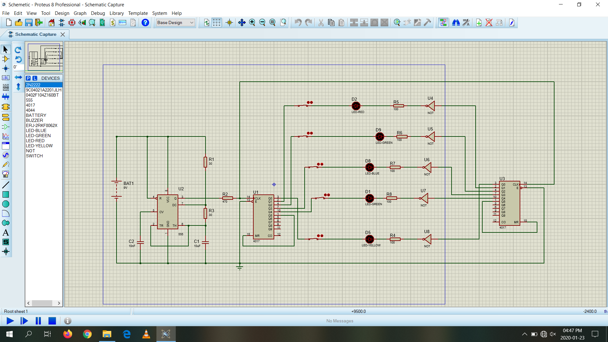
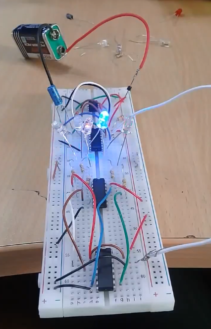

# 🎨 Colour Sequence Detector

Design of A Colour Sequence Detector for a 5-core Harness Cable

Low-cost tester for verifying the **colour sequence** and **continuity** of 5-core harness cables at both ends of a wire roll.  

---

## 📜 Overview

This device checks if both ends of a cable have the **same wire colour sequence** and ensures **continuity**.  
It was developed as a more efficient alternative to the manual continuity tester for the Harness Department at Cable Solutions (Pvt) Ltd.

---

## ⚙️ How It Works

1. A **555 Timer** generates clock pulses.  
2. Two **CD4017 Decade Counters** are clocked together:  
   - One drives the positive side of LEDs.  
   - The other (through a **NOT gate**) drives the negative side.  
3. When the wire order matches at both ends, the corresponding LED lights up.

---

## 💡 Features

- Tests **5 cores** (expandable to 10 for a single CD4017).  
- Detects **sequence** and **continuity**.  
- **No microcontroller** → reduced cost.
- Powered via 9V battery.
- Tested via **Proteus 8 Professional** simulation and breadboard prototype.

---

## 🛠 Components

- 1 × 555 Timer IC  
- 2 × CD4017 Decade Counter IC  
- 5 × NOT Gate IC (each per core)  
- 5 x LEDs (each per core)  
- 5 x Resistors (each per core)  
- Jumper Wires, Breadboard  
- 9 V Battery

---

## 📷 Project Images

**Simulation (Proteus 8 Professional):**  
  

**Breadboard Prototype:**  
  

---

## 🔮 Future Improvements

- Expand to test **up to 10 cores**.  
- Build into a **durable production-line-ready enclosure**.  

---

## 🛠 Tools & Software Used
- **Simulation Software:** Proteus 8 Professional

---

## 📄 License
This project is shared for educational purposes. Please give credit if you use it.

---

## 📬 Contact
If you have feedback or suggestions, feel free to [open an issue](https://github.com).

---
